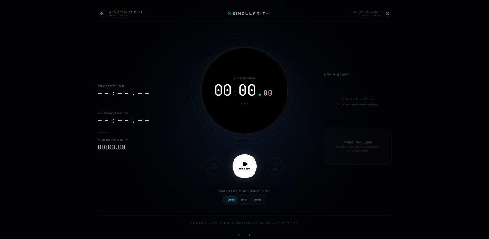

# 🌌 Chronos Singularity Stopwatch

A gravity-assisted high-precision stopwatch inspired by Einstein's theory of General Relativity and gravitational time dilation near supermassive black holes.



## 💫 Features

- **Relativistic Time Dilation (Gravitational Proximity)**
  - Choose between three orbit levels to control the warp level:
    - **`3Rs` Low Orbit**: Moderate gravitational dilation.
    - **`2Rs` Horizon**: Stronger gravitational warping.
    - **`1.5Rs` Singularity**: Maximum time dilation close to the event horizon.
  - The accretion disk and event horizon visually react, spin, and pulse according to the active warp level.

- **High-Precision Timing Core**
  - Powered by high-resolution standard performance timers (`performance.now` and `requestAnimationFrame`) to ensure zero cumulative rendering drift or background lag.

- **Interactive Accretion Disk Dial (Black Hole)**
  - Beautiful custom CSS glassmorphism and Tailwind-animated black hole visualization. The accretion disk rotates and expands/contracts dynamically as time lapses.

- **Space-Time Acoustic Synthesizer**
  - Features real-time Web Audio API sound generation. Relativistic sound wave feedback for:
    - **Start/Resume**: High frequency exponential sweeps.
    - **Pause**: Decelerating cosmic drift frequencies.
    - **Lap**: Resonant frequency chirps.
    - **Reset**: Low-frequency sawtooth sound decline.
  - Can be toggled on/off instantly via the sound button.

- **Precision Split & Lap Metrics**
  - **Fastest Lap**: Instantly isolates your quickest space-time lap.
  - **Average Pace**: Calculates your overall mean performance.
  - **Current Split**: Shows live delta tracking for the active lap segment.

- **Visual Trend Analysis & Lap History**
  - **Lap Chart**: Interactive SVG/Recharts visualization of your split-time velocity curves.
  - **Lap List**: Detailed scrollable log of all recorded time points.

- **Data Persistence & Portability**
  - **Auto-Save**: Sessions are automatically persisted in browser memory (`localStorage`), allowing you to reload the tab without losing your clock state, laps, or warp levels.
  - **Export Logs**: Copy a fully formatted time-dial log to your clipboard with one click.

---

## 🛠️ Tech Stack

- **Core**: React 19 (TypeScript)
- **Styling**: Tailwind CSS, CSS Animations, Framer Motion (`motion/react`)
- **Icons**: Lucide React
- **Data Viz**: Recharts (dynamic SVGs)
- **Audio**: Web Audio API (Synthesizer)
- **Build Tool**: Vite

---

## 🚀 Running Locally

1. **Install Dependencies:**
   ```bash
   npm install
   ```

2. **Run Development Server:**
   ```bash
   npm run dev
   ```
   Open `http://localhost:3000` in your web browser.

---

**Designed & Developed by:** Muhaimenul Islam
